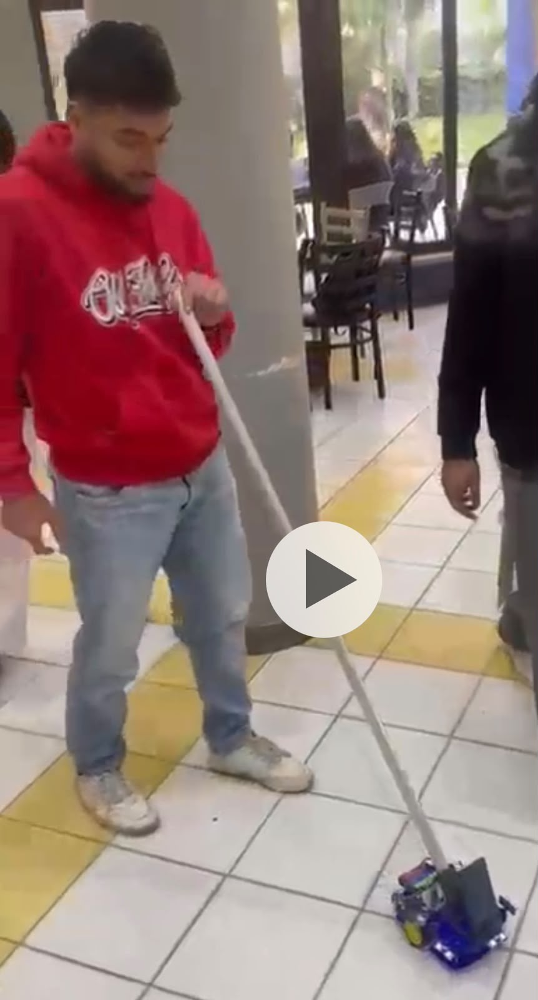
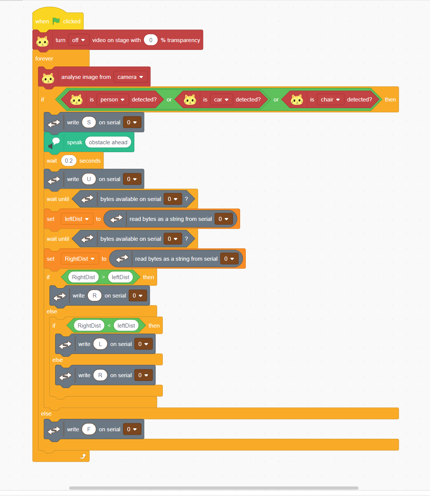
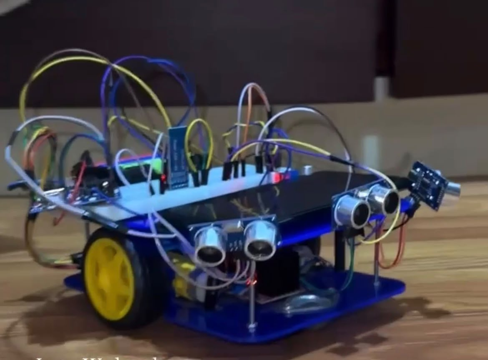
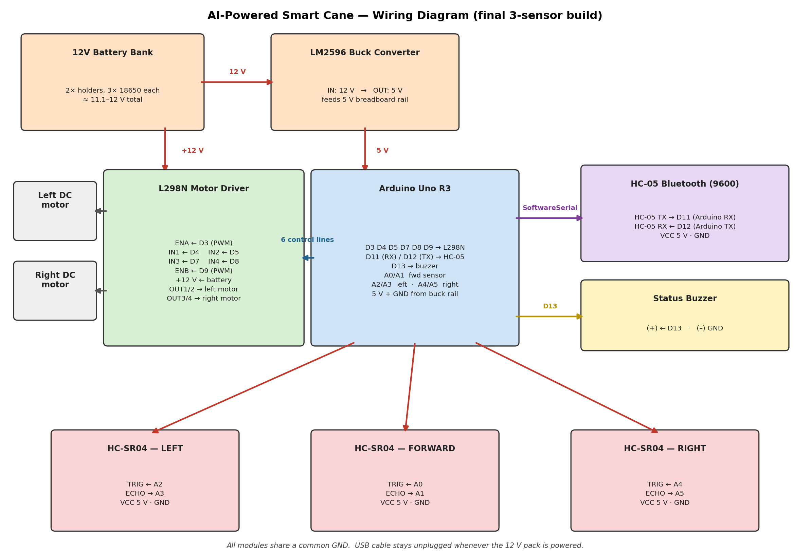

# AI-Powered Smart Cane

> Assistive smart cane combining ultrasonic safety with AI vision, built on Arduino Uno.

An assistive mobility device that helps a visually impaired user detect obstacles and navigate safely. It runs in two independent modes, so it stays useful whether or not a laptop is connected. A team project built for the Data Acquisition Systems course (7th semester) at AASTMT.



---

## Overview

The cane is built around an Arduino Uno and offers two ways to operate:

- **Mode 1 — Standalone autonomous.** The cane works entirely on its own. A front-facing ultrasonic sensor measures the distance ahead; the Arduino slows the motors down as obstacles get closer (adaptive braking) and stops completely when something is too close, sounding a buzzer. No phone or laptop is needed.
- **Mode 2 — AI-guided.** A camera-equipped laptop runs an object-detection model that watches the path, announces obstacles out loud (text-to-speech), and sends short steering commands to the cane over Bluetooth. The cane follows them — but its own obstacle safety always takes priority. If the front sensor detects danger, the motors stop regardless of the command received.

The most important design idea is that **local safety always overrides the external AI**: the low-level microcontroller rules are the final authority, and the high-level AI can only steer within those bounds.

---

## Key Features

- **Dual-mode operation** — full functionality with or without a connected laptop.
- **Adaptive braking** — motor speed scales down proportionally as obstacles get nearer, instead of an abrupt stop.
- **Safety override** — the front-sensor emergency stop overrides any Bluetooth steering command.
- **Connection watchdog** — if Bluetooth goes idle for 5 seconds, the cane automatically reverts to autonomous mode so a dropped link never leaves it stuck.
- **Turn assistance** — on request, the cane reports its left and right distances so the AI can steer toward the side with more open space.
- **AI object detection with audio alerts** — the laptop recognises obstacles and speaks a warning before sending a steering command.

---

## How It Works

### Mode 1 — Standalone autonomous

The front sensor is read on every loop:

- **Beyond 100 cm** → full speed.
- **Between 100 cm and 20 cm** → speed is mapped down proportionally (the closer the obstacle, the slower the cane).
- **Below 20 cm** → motors stop and the buzzer sounds.
- **Sensor timeout (no echo)** → treated as a fault and stops the cane, so it fails safe rather than driving blind.

### Mode 2 — AI-guided

The laptop captures frames from its camera and runs object detection. When it recognises an obstacle it announces it by voice and sends a single-character command to the cane over Bluetooth:

| Command | Action  |
|:-------:|---------|
| `F`     | Forward |
| `L`     | Turn left |
| `R`     | Turn right |
| `S`     | Stop |
| `U`     | Report left & right distances (used to choose a turn direction) |

For turn decisions the laptop sends `U`; the cane replies with its left distance, then its right distance, and the laptop steers toward the side with more space. Throughout, the front-sensor adaptive braking stays active underneath the AI commands.



---

## Hardware



| Component | Role |
|-----------|------|
| Arduino Uno R3 | Main microcontroller |
| L298N dual H-bridge + 2× DC geared motors | Differential (tank-style) drive |
| 3× HC-SR04 ultrasonic sensors | Front, left, and right distance sensing |
| HC-05 Bluetooth module | Link to the laptop (9600 baud) |
| 12 V battery bank (2 holders, 3× 18650 each) | Motor power |
| LM2596 buck converter | Regulates 12 V down to a stable 5 V logic rail |
| Status buzzer | Audible alert on a safety stop or sensor fault |

Power is split into two rails for safety: the 12 V bank drives the motor driver directly, while the LM2596 converter steps the same source down to a regulated 5 V that powers the Arduino, Bluetooth, and sensors. All modules share a common ground, and the USB cable is left unplugged whenever the 12 V pack is powering the system.

### Pin mapping

| Component | Signal | Arduino pin |
|-----------|--------|:-----------:|
| HC-05 Bluetooth | RX / TX | D11 / D12 |
| L298N | ENA (left speed, PWM) | D3 |
| L298N | IN1 / IN2 (left motor) | D4 / D5 |
| L298N | ENB (right speed, PWM) | D9 |
| L298N | IN3 / IN4 (right motor) | D7 / D8 |
| HC-SR04 front | TRIG / ECHO | A0 / A1 |
| HC-SR04 left | TRIG / ECHO | A2 / A3 |
| HC-SR04 right | TRIG / ECHO | A4 / A5 |
| Status buzzer | Signal (+) | D13 |

Pins were chosen to keep the PWM speed outputs and the Bluetooth serial link from conflicting.



---

## Tech Stack

- **Arduino (C++)** — low-level firmware written and flashed with the Arduino IDE. Uses the built-in `SoftwareSerial` library; no external libraries required.
- **PictoBlox** — block-based environment used to run the camera object-detection model and text-to-speech, communicating with the cane over the HC-05 serial link.

---

## Repository Structure

```
ai-smart-cane/
├── Smart_Cane_Final/
│   └── Smart_Cane_Final.ino     # Dual-mode Arduino firmware
├── pictoblox/
│   └── My_Project.sb3           # AI object-detection program
├── images/                       # Photos and wiring diagram
├── LICENSE
└── README.md
```

---

## How to Run

### Standalone mode (no laptop)

1. Open `Smart_Cane_Final/Smart_Cane_Final.ino` in the Arduino IDE.
2. Select **Tools → Board → Arduino Uno** and choose the correct port.
3. Connect the Arduino by USB and click **Upload**.
4. Wire the components as shown in the pin table and wiring diagram.
5. Unplug the USB cable, power the 12 V pack, and switch on. The cane drives forward and brakes automatically around obstacles.

### AI-guided mode (with laptop)

1. Pair the HC-05 module with the laptop over Bluetooth.
2. Open `pictoblox/My_Project.sb3` in PictoBlox.
3. Connect PictoBlox to the HC-05 serial port.
4. Click the green flag to run. The laptop camera detects obstacles, speaks alerts, and sends steering commands while the cane keeps its own front-sensor safety active.

---

## Testing

The control logic was verified against a set of scenario tests covering both modes:

- Clear path → full speed
- Obstacle at mid-range → correct proportional slowdown
- `U` query → correct left-then-right distance reply
- Left and right pivot turns
- Emergency stop overriding an active Bluetooth command
- Sensor timeout → safe stop
- Bluetooth idle for 5 seconds → watchdog reverts to autonomous mode

All scenarios produced the expected motor and buzzer behaviour. The assembled cane was then demonstrated driving and stopping around obstacles in a live run.

---

## Challenges & Troubleshooting

- **Sensor timeouts.** Early runs showed intermittent ultrasonic dropouts, traced to loose breadboard contacts. Switching to firm DuPont jumpers and stabilising the 5 V rail through the buck converter gave clean, reliable trigger pulses.
- **Platform constraints for the vision model.** Running the detection model on a phone proved unreliable due to camera and permission limits, so a laptop was used as the processing node for stable detection.
- **Power separation.** A key rule emerged during testing: never feed a second supply into the Arduino 5 V pin while USB is connected. The buck converter powers the logic rail, and USB stays unplugged during powered trials.
- **Drop-off sensor.** A VL53L0X time-of-flight sensor was planned for detecting steps and edges, but it short-circuited during assembly and was removed to keep the rest of the system stable. It is listed under future improvements.

---

## What I Learned

- Debugging real hardware, where the fix is often a loose wire or a power issue rather than the code.
- Managing power safely across a shared circuit, and why separating a high-current motor rail from a regulated logic rail matters.
- Serial communication between an Arduino and a computer, including handling dropped connections gracefully with a watchdog timer.
- Designing a system with a clear safety boundary — where the local, low-level rules always override higher-level commands. Building that override mindset (never fully trusting an external input) is something I want to carry into cybersecurity.
- Integrating an AI vision model with an embedded system and getting two very different platforms to work together over one link.

---

## Future Improvements

- **Haptic feedback in the handle** — a small vibrating motor so the user feels a stop, not only hears it.
- **Soldered board** — move from breadboard to a soldered proto-board or custom PCB for durability under real use.
- **Drop-off detection** — re-add a downward time-of-flight sensor to catch steps and holes ahead of the cane.
- **Weather-resistant enclosure** — a 3D-printed housing to protect the electronics.

---

## Development Notes

The firmware here is a faithful reconstruction of the version demonstrated in class. The original sketch was lost after the demo, so it was rebuilt from the team's documentation and the recorded behaviour — the same wiring, the same Bluetooth protocol, and the same adaptive-braking and safety logic — then re-verified against the scenario tests above before publishing. Parts of the firmware were written with AI assistance and then reviewed, adjusted, and tested by the team.

---

## Team & Course

Built by a team of 5 students for the **Data Acquisition Systems** course (7th semester), **September 2025**, at the Arab Academy for Science, Technology and Maritime Transport (AASTMT). The team collaborated across all parts of the project: hardware assembly and wiring, firmware, the AI vision program, testing, and documentation.

---

## License

Released under the [MIT License](LICENSE).
